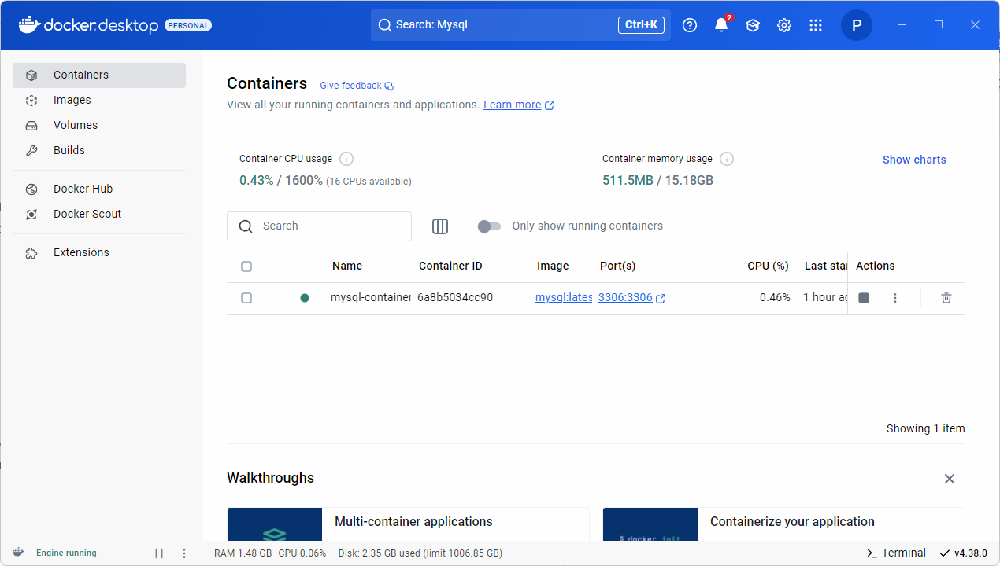
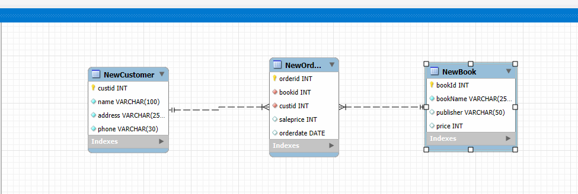

# iot-database-2025
IoT 개발자 데이터베이스 저장소

## 1일차
- 데이터베이스 시스템
    - 통합된 데이터를 저장해서 운영하면서, 동시에 여러사람이 사용할 수 있도록 하는 시스템
    - 실시간 접근, 계속 변경, 동시 공유가 가능, 내용으로 참조(물리적으로 떨어져 있어도 사용가능)

    - DBMS : SQL Server , Oracle , MySQL , MariaDB , MongoDB .....

- 데이터베이스 언어
    - **SQL (Structured Query Language)**:  
        데이터베이스와 상호작용하기 위한 **표준 언어**.  
        주로 **데이터 정의, 조작, 제어**를 위해 사용합니다.  

    - **DDL (Data Definition Language)**:  
        **스키마 정의 및 구조 변경**을 담당.  
      - 예시: `CREATE`, `ALTER`, `DROP`, `TRUNCATE`  

    - **DML (Data Manipulation Language)**:  
        **데이터(인스턴스)를 검색, 삽입, 수정, 삭제**하는 언어.  
      - 예시: `SELECT`, `INSERT`, `UPDATE`, `DELETE`  

    - **DCL (Data Control Language)**:  
        **사용자 권한 및 접근 제어**를 담당.  
      - 예시: `GRANT`, `REVOKE`  


- MySQL 설치(Docker)
    1. 파워쉘을 오픈, 도커 확인
        ```shell
        > docker -v
        Docker version 27.5.1, build 9f9e405
        ```
    2. MySQL Docker 이미지 다운로드
        ```shell
        > docker pull mysql
        Using default tag: latest
        latest: Pulling from library/mysql
        893b018337e2: Download complete
        43759093d4f6: Downloading [============================>                      ]  28.31MB/49.09MB
        cc9646b08259: Downloading [========>                                          ]  22.02MB/135.7MB
        df1ba1ac457a: Download complete
        277ab5f6ddde: Downloading [=========>                                         ]  9.437MB/48.42MB
        ...
        Status: Downloaded newer image for mysql:latest
        docker.io/library/mysql:latest
        ```
    3. MySQL Image 확인
        ```shell
        > docker images
        REPOSITORY   TAG       IMAGE ID       CREATED       SIZE
        mysql        latest    146682692a3a   4 weeks ago   1.09GB
        ```
    4. Docker 컨테이너 생성
        - MySQL Port번호 3306이 기본
        - Oracle Port 1521
        - SQL Server 1433
        ```shell
        > docker run --name mysql-container -e MYSQL_ROOT_PASSWORD=12345 -d -p 3306:3306 mysql:latest
        ```
    5. 컨테이너 확인
        ```shell
        > docker ps -a
        CONTAINER ID   IMAGE          COMMAND                   CREATED          STATUS          PORTS
     NAMES
        6a8b5034cc90   mysql:latest   "docker-entrypoint.s…"   16 seconds ago   Up 15 seconds   0.0.0.0:3306->3306/tcp, 33060/tcp   mysql-container
        ```
    
    6. Docker 컨테이너 시작, 중지, 재시작
        ```shell
        > docker stop mysql-container       # 중지
        > docker start mysql-container      # 시작
        > docker restart mysql-container    # 재시작
        ```

    7. MySQL Docker 컨테이너 접속
        ```shell
        > docker exec -it mysql-container bash  # bash 리눅스의 powershell
        bash-5.1# mysql -u root -p
        Enter password:
        Welcome to the MySQL monitor.  Commands end with ; or \g.
        Your MySQL connection id is 9
        Server version: 9.2.0 MySQL Community Server - GPL

        Copyright (c) 2000, 2025, Oracle and/or its affiliates.

        Oracle is a registered trademark of Oracle Corporation and/or its
        affiliates. Other names may be trademarks of their respective
        owners.

        Type 'help;' or '\h' for help. Type '\c' to clear the current input statement.

        mysql> show databases;
        +--------------------+
        | Database           |
        +--------------------+
        | information_schema |
        | mysql              |
        | performance_schema |
        | sys                |
        +--------------------+
        4 rows in set (0.01 sec)
        ```



- Workbench 설치
    - https://dev.mysql.com/downloads/workbench/ MySQL Workbench 8.0.41 다운로드 설치
    - MySQL Installer에서 Workbench, Sample 만 설치

    - Workbench 실행 후
        1. MySQL Connections + 클릭

- 관계 데이터 모델
    - 3단계 DB 구조 : 외부 스키마(실세계와 매핑) -> 개념 스키마(DB논리적 설계) -> 내부 스키마(물리적 설계) -> DB

    - 모델에 쓰이는 용어
        - 릴레이션 : 테이블
        - 튜플 : 로우
        - 속성(어트리뷰트) : 컬럼
        - 스키마 : DB 구조
        - 인스턴스 : 스키마 구조를 따라 들어간 데이터(있을수도 있고 없을수도 있고)
        - 관계 : 릴레이션 간의 부모, 자식 연관

    - 무결성 제약조건
        - 키 : **기본키**, **외래키** ,슈퍼키
            - 기본키 : 후보키 중 선택된 키
            - 슈퍼키 : 최소성을 만족하지 못함.
        
        - 무결성 제약조건 3종 요약
            1. 🆔 **개체 무결성(Entity Integrity)**  
            - **기본키는 NULL과 중복을 허용하지 않는다!**  
            2. 🔗 **참조 무결성(Referential Integrity)**  
            - **외래키는 참조하는 기본키에 존재해야 한다!**  
            (존재하지 않는 값을 참조하면 안 됨)  
            3. 🎯 **도메인 무결성(Domain Integrity)**  
            - **컬럼 값은 지정된 데이터 타입과 제약조건을 지켜야 한다!**  


- SQL 기초
    - SQL 개요
    
    ```sql
    -- DML SELECT문
    SELECT publisher, price
      FROM Book
     WHERE bookname = '축구의 역사'; -- 주석입니다
    ```


## 2일차
- SQL 기초
    - 개요
        - 데이터베이스에 있는 데이터를 추출 및 처리작업을 위해서 사용되는 프로그래밍언어
        - 일반 프로그래밍언어와의 차이점
            - DB에서만 문제해결 가능
            - 입출력을 모두 DB에서 테이블로 처리
            - 컴파일 및 실행은 DBMS가 수행

        - DML(데이터 조작어) - 검색, 삽입, 수정, 삭제
            - SELECT, INSERT, UPDATE, DELETE
        - DDL(데이터 정의어)
            - CREATE, ALTER, DROP
        - DCL(데이터 제어어)
            - GRANT, REVOKE

    - DML 중 SELECT 만

        ```sql
         SELECT [ALL|DISTINCT] 컬럼명(들)
           FROM 테이블(들)
         (WHERE) 조건(들)
         (GROUP BY 속성이름(들))
        (HAVING 집계함수 조건(들))
         (ORDER BY 정렬기준(들) ASC|DESC)
          (WITH ROLLUP) : 누계 등 표시
        ```

    - 쿼리 연습 ~GROUP BY   : [MySQL](./day02/db01_select.sql)
    - 쿼리 연습  ~EXISTS    : [MySQL](./day02/db02_select_GroupBy.sql)


## 3일차
- Visual Studio Code 에서 MySQL 연동
    - Weijan Chen 개인개발자가 만든 MySQL 확장도 준수
    - Weijan Chen 이 개발한 Database Client를 설치(추천)
    - Database Client 는 많은 DB연결이 가능!
        - 데이터베이스 아이콘 생성
    - Oracle에서 개발한 MySQL Shell for VS Code를 사용 하지말것(너무 불편함)
    - Database Client
        1. 툴 바의 Database 아이콘 클릭
        2. Create Connection 클릭
        3. 정보 입력 > 연결 테스트
        
        4. Workbench 처럼 사용
        

- SQL 기초
    - 기본 데이터형
        - 데이터베이스에는 엄청 많은 데이터형이 존재(데이터의 사이즈 저장용량을 절약하기 위해서)
        - 주요 데이터형
            - SmallInt(2)   : signed $2^{16}$
            - `Int(4)`       : signed $2^{32}$
            - BigInt(8)     : signed $2^{64}$
            - Float(4)      : 부동소수점 표현(소수점아래 7자리까지 저장)
            - Decimal(5~17) : Float보다 더 큰 수 저장시 사용
            - CHAR(n)       : 고정길이 문자형, n : (1~255)
                - 주의점! Char(10)에 'Hello' 글자를 입력하면 'Hello&nbsp;&nbsp;&nbsp;&nbsp;&nbsp;'
            - VARCHAR(n)    : 가변길이 문자열, n : (1~65535)
                - 주의점! VARCHAR(10)에 'Hello' 글자를 입력하면 'Hello'
            - Longtext(최대4GB) - 뉴스나 영화스크립트 저장 시 사용
            - LongBlob(최대4GB) - mp3 , mp4 , 음악 , 영화데이터 자체 저장 시 사용
            - Date(3) - 2025-02-27(오늘날짜) 까지 저장하는 타입
            - DateTime(8) - 2025-02-27 10:46:34(오늘날짜 시간) 까지 저장하는 타입
            - JSON(8) - json 타입 데이터를 저장

    - DDL : CREATE

        ```sql
        CREATE DATABASE DB명
        CHARACTER SET utf8mb4
        COLLATE utf8mb4_unicode_ci;

        CREATE TABLE 테이블명
        (
            속성(컬럼)명 제약사항들[NOT NULL|UNIQUE|DEFAULT|CHECK|...]
            PRIMARY KEY(컬럼)
            FOREIGN KEY(컬럼) REFERENCES 테이블명(컬럼) ON DELETE [CASCADE|RESTRICE|SET..]
        );

        ALTER DATABASE DB명
        [변경사항]
        
        ALTER TABLE 테이블명 [이미 존재하는 컬럼은 MODIFY , 삭제시 DROP , 추가 : ADD]
        -- 예시
        ALTER TABLE NewBook ADD isbn VARCHAR(13);
        ALTER TABLE NewBook MODIFY isbn INTEGER;
        ALTER TABLE NewBook DROP isbn;
        ALTER TABLE NewBook MODIFY bookname VARCHAR(255) NOT NULL;

        DROP [TABLE|DATABASE] 객체명;
        ```

        - 테이블 생성 후 확인
            1. Database 메뉴 -> Reverse Engineer(Ctrl+R) : 데이터베이스를 ERD로 변경
            2. 연결은 패스
            3. Select Schema to RE 에서 특정 스키마를 선택
            4. Execute 버튼 클릭
            5. ERD 확인

            

    - DDL : ALTER
    - DML 중 INSERT , UPDATE , DELETE
- SQL 고급
    - 내장 함수
        - 절대값 : ABS()
        - 반올림 : ROUND(숫자, 자리수)
        - 문자열치환 : REPLACE(테이블명,'타겟','바꿀문자열')
        - 바이트수 : LENGTH()
        - 문자수 : CHAR_LENGTH()
        - 문자열자르기 : SUBSTR(컬럼명,시작,끝) **시작인덱스 1**
        - 날짜형 관련
            - STR_TO_DATE(string,format) : 문자열데이터를 date형으로 반환
            - DATE_FORMAT(date,format) : 날짜형 데이터를 VARCHAR로 반환
            - ADDDATE(date,INTERVAL dd DAY) : 해당 날짜에서 인터벌만큼 지난 날짜반환
            - DATE(date) : date타입의 날짜부분만 반환 (년-월-일)
            - DATEDIFF(date1,date2) : date1 - date2 의 날짜 차이 (day)
            - SYSDATE() : DMBS 시스템상의 오늘 년월일시분초 반환
            - 날짜형 지정자
                - %Y(2025) %y(25) %M(January) %m(02) %d(날짜) %a(Sunday) %W(Sun) %w(sunday = 0)
                - %H(00~23) %h(01~12) %i(min) %s(second)

    - NULL
        - NULL 자체는 '' 이런것과 달리 아예 존재하지가 않기 때문에 다르다.
        - NULL + 숫자 = NULL
        - NULL 값은 집계함수를 사용자의 의도와 다르게 사용되게한다.
        - COUNT(), AVG() 등등에서 NULL 값은 집계되지 않아 꼬이는 일이 많다.
        - 그래서 IS NOT NULL , IS NULL 등을 활용하여 핸들링을 해줘야 한다.
        - IFNULL(컬럼, 값) : 컬럼의 값이 NULL이면, '값' 으로 대치한다.

## 4일차
- SQL 고급 
    - 행번호 출력 : [SQL](./day04/db01.sql)
         - LIMIT, OFFSET 잘 쓰면 필요없음
         - 행 번호가 필요한 경우도 있다.

- SubQuery 고급 : [SQL](./day04/db02_subQuery.sql)
    - Where 절 - 단일값(비교연산), 다중행(ALL|ANY|EXISTS|IN|NOT IN)
    - Select 절 - 무조건 스칼라값
    - From 절 - 인라인 뷰. 하나의 테이블처럼 사용 (가상테이블)

- SQL 고급
    - VIEW : [SQL](./day04/db03_View.sql)
        - 보여주고 싶은 부분만 가공해서 보여주려고 만든 VIEW
        - 인덱스 없음
        - 단일 테이블로 생성 시 수정이가능 (원본이 수정됨)
        - 조인과 같은 복합 테이블로 생성시 수정 불가
    
    - INDEX : [SQL](./day04/db04.sql)
        - 빠른 검색을 위해서 사용하는 개체
        - 클러스터 인덱스 : 주로 PK 이며 자동으로 생성된다.
        - 논클러스터 인덱스(보조) : 여러개를 생성가능하며 수동으로 생성해야한다. 생성시 자동으로 밸런스 트리구조로 생성된다.
        - 주의점
            - WHERE 절에 자주 사용하는 컬럼에 인덱스 생성
            - 조인문에 사용하는 컬럼에 생성
            - 테이블 당 인덱스 개수는 5개 미만이 효율적
            - 변경이 잦은 컬럼에는 생성하지 말자..
            - NULL 값이 많은 컬럼에도 생성하지 말자..!

- DB 프로그래밍
    - Procedure : [SQL](./day04/db06_procedure.sql)
        - 리턴값이 VOID 인 함수라고 생각하면 된다.
        - 파이썬 등 프로그래밍 언어에서 좀 더 편리하게 사용하기 위해 구현.
        - 개발 솔루션화, 구조화 해서 손쉽게 DB처리를 가능하게 하기 위해.
        - 예제 : [SQL](./day04/db07_Save_Procedure.sql)

## 5일차